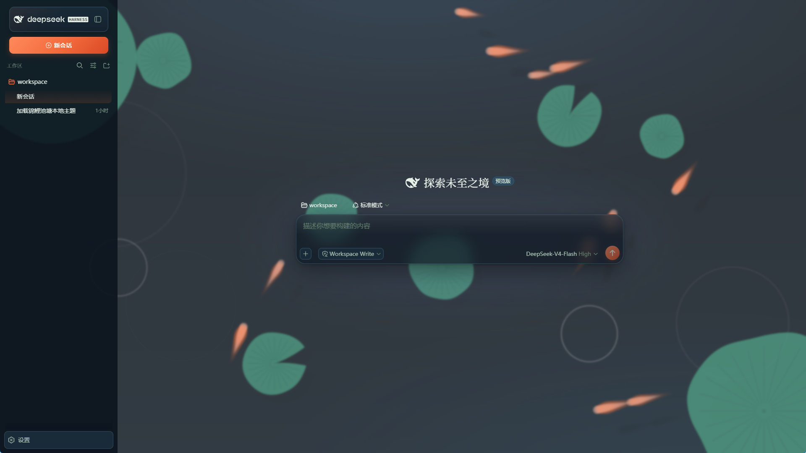
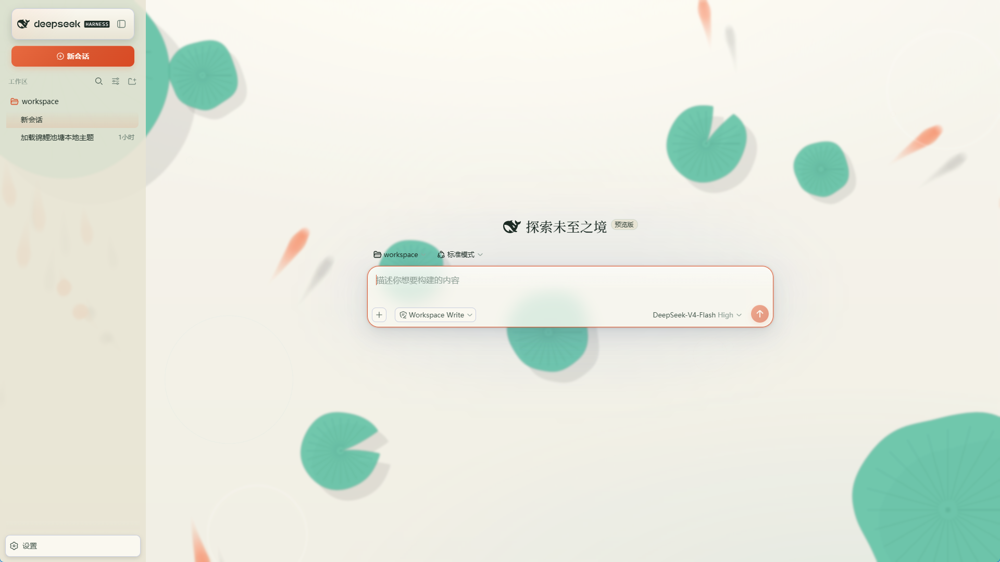

# dsh-skin-koi-pond · 锦鲤池塘

> DeepSeek Harness (DSH) WebUI 主题 —— 墨青池水、锦鲤点红。

[](LICENSE)
[](#贡献)
[](https://github.com/Kogisune/dsh-skin-koi-pond/releases)
[](https://github.com/Kogisune/dsh-skin-koi-pond/stargazers)
[](https://github.com/Kogisune/dsh-skin-koi-pond/commits)

一套以「锦鲤池塘」为意象的 DeepSeek Harness WebUI 主题。墨青池水作底、水波涟漪为纹，锦鲤橙红点睛、金鳞与荷叶绿辅佐；昼有「宣纸日色」、夜有「池塘夜色」，亮暗双主题皆备。

主题遵循 `skin.json` 声明 + 按部件拆分 CSS（7 部件）的规范，是**纯展示层**：仅覆盖 DSH 官方设计令牌（`--dsw-alias-*`）与部件样式，不注入服务、不发 Cordis 事件、不触达模型请求。开箱即用，安装即生效。

[English version](README.en.md) 🌐

---

## ✨ 特性

- 🐟 **Canvas 锦鲤池塘动画**：原生 Canvas 2D 鱼群（flocking 聚群 / 对齐 / 分离 + 鼠标驱赶逃逸），荷叶 Perlin 边缘与缺刻、水波涟漪，点击水面泛起波纹；无 p5 依赖，`prefers-reduced-motion` 自动降级为静态渲染，页面隐藏时暂停
- 🎨 **亮暗双主题**：深色「池塘夜色」（墨青池水 + 月光白 + 锦鲤橙红 `#f26a3c`）/ 浅色「宣纸日色」（米白宣纸 + 墨色 + 朱红 `#d9562f`）
- 🪟 **背景遮罩**：15% 白 + 3px 模糊，柔化动画、突出前景 UI
- 🧩 **组件化主题**：7 部件拆分（`background` / `sidebar` / `titlebar` / `composer` / `overlay` / `fonts` / `ui`），结构清晰、便于维护
- 🌊 **辅助色**：金鳞 `#d9a441` / 荷叶 `#3fae7a` / 水光蓝 `#4fb8c9`
- 🎮 **实时换色**：浏览器控制台 `__koiSetScheme('ogon')`（9 套锦鲤预设 + 随机彩蛋），不重建鱼群

---

## 🖼 预览

<p align="center">
  
  
</p>

<p align="center">深色「池塘夜色」 · 浅色「宣纸日色」</p>

---

## 📦 安装

作为 DSH 插件（bundle 直载）安装：

```bash
dsh plugin --profile web add github:Kogisune/dsh-skin-koi-pond
# 重启 dsh web 生效；卸载即复原
```

---

## 🎨 自定义

主题在浏览器中暴露 `window.__koiSetScheme(id)`，可实时切换锦鲤配色，**不会重建鱼群**：

```js
__koiSetScheme('ogon')     // 黄金
__koiSetScheme('tancho')   // 丹顶
__koiSetScheme('random')   // 随机彩蛋（含低概率隐藏配色）
```

内置预设：

| id | 名称 | 鱼身主色 | 尾腹色 |
| --- | --- | --- | --- |
| `kohaku` | 红白 | `#ffffff` | `#e23b2e` |
| `sanke` | 大正三色 | `#ffffff` | `#141414` |
| `showa` | 昭和三色 | `#141414` | `#e23b2e` |
| `ogon` | 黄金 | `#f4c430` | `#d99a00` |
| `tancho` | 丹顶 | `#ffffff` | `#ff3b30` |
| `asagi` | 浅黄 | `#3b6fb5` | `#e23b2e` |
| `utsuri` | 绯写 | `#f1541b` | `#141414` |
| `panda` | 写鲤（黑白） | `#141414` | `#ffffff` |
| `momiji` | 落叶 | `#f1541b` | `#ffffff` |
| `random` | 随机彩蛋 | 运行时随机 | 运行时随机 |

---

## 🧩 主题结构

`skin.json` 声明：

```jsonc
{
  "id": "koi-pond",
  "name": "锦鲤池塘",
  "theme": {
    "kind": "full",            // 完整皮肤（与其它完整主题互斥）
    "family": "koi",           // 系列：同系列主题互斥
    "components": { /* 7 部件全量 */ }
  },
  "css": {
    "*": ["css/base.css"],          // 共享基础（设计令牌）
    "background": ["css/background.css"],
    "sidebar": ["css/sidebar.css"],
    "titlebar": ["css/titlebar.css"],
    "composer": ["css/composer.css"],
    "overlay": ["css/overlay.css"],
    "fonts": ["css/fonts.css"],
    "ui": ["css/ui.css"]
  }
}
```

- 按部件拆分 CSS → 各部件在 `skin.json` 的 `css` 字段独立声明，结构清晰
- `theme.family: koi` → 与同系列主题互斥，不会与其它系列皮肤踩踏
- `z-index` 统一走 `--koi-z-*` 变量，规避弹层撞车

---

## 🛠 开发

```bash
node scripts/build.mjs        # 构建：css/ + koi 模块 → lib/client.js 自包含 bundle（CSS 内联）
node scripts/validate.mjs     # 结构校验（skin.json / css 文件 / 部件一致性）
pnpm test                     # 同 validate
```

> ⚠️ 改过 `css/` 或 `plugin/` 后必须重新 `node scripts/build.mjs` 才会在 DSH 中生效（DSH 加载的是 `lib/` 构建产物）。

---

## 📁 目录结构

```
css/            # 按部件拆分的主题 CSS
plugin/         # 插件源码（index.js 宿主入口 / client.js 客户端注入 / koi/ 动画引擎）
scripts/        # build / validate
lib/            # 构建产物（已提交，clone 即用）
```

---

## 🙏 致谢

- 锦鲤池塘动画引擎（`plugin/koi/`）移植自 [carps.top](https://www.carps.top)（MIT，AstroPaper 衍生项目），原实现为博客背景的锦鲤池塘 Canvas 动画。

---

## 🤝 贡献

欢迎提交 issue 与 PR。提交前请先运行 `node scripts/validate.mjs` 确保结构与部件一致性通过。

---

## 📄 许可证

[MIT](LICENSE) © [Kogisune](https://github.com/Kogisune)
